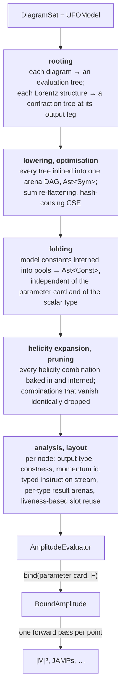

# The amplitude compiler

MadGraph is a code generator. For each process it writes a Fortran file,
`matrix1.f`, whose body is a straight-line sequence of HELAS calls, one per
wavefunction, current and amplitude, and hands it to a compiler. That
design has a cost that has nothing to do with physics: a Fortran toolchain
on the user's machine, a compile step per process, and generated code that
cannot be inspected or transformed once written.

vibegraph does not generate source code. The matrix element is compiled at
model-load time, inside the running program, into a data structure that an
interpreter executes per phase-space point. This chapter is about that
compiler: what its intermediate representation is, which passes it runs,
and which ideas from compiler construction each pass is an instance of.
Physics is confined to the kernels at the bottom; everything above them is
computer science.

The whole pipeline, in order:

Two properties hold the design together. Every pass is a pure function of
the previous representation, so each can be validated on its own; and the
constant pools, the only place the parameter card enters, sit at the end,
so one compiled skeleton serves any card and any scalar precision.

## Rooting: from a graph to an evaluation order

A Feynman diagram is an undirected tree. The HELAS scheme evaluates it from
the leaves toward one vertex ([helicity amplitudes](04-helicity-amplitudes.md#helas)),
which is to say it needs the tree *rooted*: every internal line oriented
toward the root, so that the current on it is computed from the subtree it
cuts off. Rooting is the first pass, and it is applied at two levels.

At the diagram level, a vertex is chosen as root and every edge directed
toward it, producing a tree whose nodes are typed by what they produce: an
external wavefunction, an off-shell current, a propagated current, or the
final amplitude. The choice of root is a choice of evaluation order and
therefore of which intermediate currents exist. Different rootings of the
same diagram compute the same amplitude with different intermediates, and
two diagrams share work only when their rootings produce identical
subtrees. Production roots every diagram at the vertex with the fewest
directly attached external legs, ties broken toward the lowest vertex
index, a rule a rooting study found to capture nearly all of the roughly
20% node reduction available over feyngraph's own vertex order. Rooting
must not change the physics, and that is pinned rather than assumed: the
convention signs that depend on orientation are lifted into each diagram's
Fermi sign at the canonical rooting, and a rooting-soundness gate in the
test suite re-roots diagrams at every vertex and asserts $|\mathcal{M}|^2$
is invariant.

At the vertex level, a UFO Lorentz structure is a tensor network whose
output leg is now known. Rooting it at that leg means picking an order to
contract the network so that every intermediate is a spinor, a vector or a
scalar the primitives can represent, and deciding for each fermion line
which end is the bra and which the ket. The result is a tree of primitive
operations with wavefunction inputs at the leaves. This is instruction
selection in the compiler sense: the abstract structure
`Gamma(3,2,-1)*ProjM(-1,1)` becomes a specific `FfvVout` node with the
per-chirality couplings as scalar operands, because a fused kernel exists
for that shape and is cheaper than the two contractions it replaces.

## Lowering: one arena for the whole amplitude

The rooted trees of every diagram are inlined into a single **arena**: a
flat vector of nodes, each an operation tag plus a typed leaf payload,
with children stored in a separate ragged (CSR) table by index. Nodes are
appended bottom-up, so a child's index is always smaller than its
parent's. That invariant is the whole evaluation strategy: walking the
arena from index zero upward is a topological order, and every node's
operands are already computed when it is reached.

The arena is a DAG, not a forest. When a current feeds two diagrams it is
lowered once and referenced twice by index. Multi-term sums and products
are emitted as balanced trees of binary nodes, which is the fixed-arity
form a term-rewriting system wants, and the arena prints as an
s-expression and parses back from one, which is the textual IR boundary
used by tests and by the e-graph stage below.

**Common-subexpression elimination** then runs as hash-consing: every node
is keyed on its operation and its children's indices, and a node equal to
an earlier one is replaced by a reference to it. Because rooting orients
identical subdiagrams identically, currents shared across diagrams collide
in the hash table and are computed once. This is the mechanism MadGraph
calls wavefunction reuse ([Alwall et al. 2011](../bibliography.md#the-pipeline-as-a-whole)),
performed here as a generic pass over an IR rather than at code-emission
time. Sums are re-flattened afterwards into one n-ary addition per sum: the
forward-pass evaluator materialises a result slot per node, so every binary
partial sum would cost a full slot of memory traffic, and the balanced
shape was measured to be slower than a single accumulation.

## Folding: binding times

A compiled amplitude depends on four kinds of input that change at very
different rates: the model's structure (fixed at load), the parameter card
(fixed per run), the phase-space point (changes per evaluation), and the
helicity combination (changes per evaluation, inside the point). Keeping
these apart is a **staging** decision, and the folding pass is where it is
made.

Every leaf that depends only on the model and the card, a coupling, a mass,
a width, a rational coefficient, is interned into one of two constant
pools: complex values and real values, kept separate so that chains of
real factors multiply in real arithmetic. Any subgraph all of whose leaves
are constants is collapsed into a single pool entry, so the products of
couplings and colour coefficients that appear at every vertex are computed
once per card, not once per point per helicity. What remains is
`Ast<Const>`, a skeleton whose leaves are pool indices and which is
independent of the card and of the scalar type. Binding a card evaluates
the pools at the chosen precision and nothing else. Binding a whole card
still walks the model's parameter graph, which is too slow to repeat per
event; the [per-event coupling](#rescaling-the-strong-coupling) below moves
the pools directly instead.

## Helicity expansion

The helicity-summed $|\mathcal{M}|^2$ needs the amplitude at every
surviving helicity combination, sixteen for a $2\to2$ fermion process
and 256 for a $2\to6$ one. Running the arena once per combination
wastes most of the work: a current depends only on the helicities of the
legs in its own subtree, so a current over two legs takes at most four
distinct values across all combinations.

The expansion makes this sharing structural. Every combination is baked
into one arena under a variadic root, with each external leaf specialised
to a `(leg, helicity)` pair, and the whole thing is hash-consed again.
Two combinations that agree on the legs beneath a node produce the same
node, and it is interned once. The expanded arena computes each distinct
current exactly once per phase-space point, in a single linear pass with no
skip predicate, which is the arithmetic minimum for the sum. Measured
sharing runs from 2.8× on $e^+e^-\to\mu^+\mu^-$ to 1.8× on a
$2\to6$ process. In compiler terms this is loop unrolling followed by
specialisation and global CSE; in MadGraph's terms it is helicity recycling
([Mattelaer & Ostrolenk 2021](../bibliography.md#the-amplitude-compiler)),
obtained through the hash table rather than by restructuring calls. The
expansion is built lazily, since only the helicity-summed entry point needs
it; single-helicity evaluation, which is what event unweighting does, keeps
the compact arena.

Momenta are handled once, outside the helicity loop. Every current's
momentum is a compile-time signed combination of external momenta, the
same for every helicity, so a per-point momentum table is filled first and
the arena refers to entries by id.

## Helicity pruning

Combinations that vanish identically, by chirality conservation along
massless lines or by angular-momentum conservation about the beam axis,
should not be in the expansion at all. Deciding which vanish symbolically
would need a zero-propagation rule per kernel, each a convention claim to
be pinned. Instead the compiler *probes*: it evaluates the full expansion
at ten deterministic, generic centre-of-mass phase-space points and drops
every combination whose contribution is below $10^{-24}$ of the total
at all of them.

The justification is the Schwartz–Zippel lemma. Each helicity amplitude
is a rational function of the momenta; a rational function that vanishes
at random generic points vanishes on the whole variety with probability
one. The threshold is chosen where the measured spectrum of contributions
is empty: identically-zero combinations come out as exact zeros or as
cancellation residues below $10^{-30}$, and the smallest genuine
contribution seen is around $10^{-12}$, so the dropped terms are below
half an ulp of every partial sum and the pruned result equals the unpruned
one bit for bit. The survivor sets match MadGraph's generated `NHEL` tables
exactly, process by process.

The probe fixes a contract. Some zeros hold only in the partonic
centre-of-mass frame with the beams along $\pm z$, because helicity of
a massive particle is not boost invariant. A pruned evaluator therefore
takes momenta in that frame, which is MadGraph's contract as well. The
contract is not in the type system: a pruned evaluator carries a flag, and
every helicity-summed entry point checks the momenta against it at run
time, refusing a frame it cannot evaluate correctly rather than returning
a wrong sum.

## Static analysis and layout

One forward scan over the arena annotates each node with three facts that
depend on neither card nor point: its **output type** (real constant,
scalar constant, scalar current, vector, fermion ket, fermion bra), whether
it is a **constant** (used by the folding above), and its **momentum id**.
The output type is a type inference over the IR, mirroring the dispatch the
interpreter would otherwise do at run time on an enum tag; the momentum id
is an abstract interpretation in which the abstract value of a node is the
signed combination of external momenta it carries.

The typed arena is then lowered to a **program**: one instruction per node
with operands resolved to `(result class, index)` pairs into per-class
result arenas, a structure-of-arrays layout in which a scalar occupies
sixteen bytes rather than the hundred and four a tagged union of all
wavefunction kinds would. Slots are allocated by **liveness**: a result's
slot is released after its last read and reused, so the arena size is the
peak number of simultaneously live values, not the node count. The
difference is large; a $2\to6$ expansion of half a million nodes peaks
at about 27 000 live slots and fits in cache. Roots are pinned live to the
end, and no instruction writes over its own operands.

The instruction order is the one property of a program that changes no
value. Production emits nodes grouped by instruction kind within each
dependency level, so that the interpreter's single indirect dispatch sees
long runs of one variant and the CPU's branch predictor, which predicts an
indirect jump from its recent history, guesses right.[^dispatch] Alternative
schedules exist as a study hook, with metrics for operand distance,
live-set width, dispatch-run length and critical-path depth.

[^dispatch]: A loop with one `match` per instruction is a *switch-dispatch*
    interpreter, and its cost is dominated by that one mispredictable
    jump. The classic remedy is *direct threading*: each instruction's
    handler jumps straight to the next handler, giving the predictor one
    site per instruction kind. A safe-Rust version needs guaranteed tail
    calls, which is the nightly `become` feature, so it stays a tracked
    option rather than a pass. Threading the dispatch through function
    pointers was measured and rejected as slower.

## Interpretation and kernels

Evaluating a bound amplitude is a single pass over the instruction stream,
each instruction dispatching to one kernel. The kernels are the only code
that knows what a gamma matrix is: one function per Lorentz-carrying
operation, generic over the scalar field, calling the representation
layer's primitives. Structural operations (add, multiply, constant loads,
external wavefunction construction) live in the dispatch itself.

Everything above the kernels is checked by invariants that do not mention
physics. A pass that preserves arithmetic order (folding, layout,
expansion) must leave every result bit-identical, and the tests assert
equality, not tolerance. A pass that re-associates a sum (the momentum
table) is held to a relative tolerance sized for the re-association and
nothing more.

## SIMD lanes

The scalar type `F` is a trait. Instantiating the bound amplitude at
`F = NumericArray<f64, N>` evaluates $N$ phase-space points in one pass,
every elementwise operation acting per lane, so each lane's result is bit
for bit the scalar result at that point. The one thing that can break this
is a data-dependent branch on `F`, which on a lane pack reduces to a single
boolean and applies one formula to every lane. The evaluator's contract is
that every such branch is lane-uniform by construction. They all sit in
the external wavefunction constructors and the vector propagator: forks on
a mass being zero (a card constant, identical across lanes), and forks in
the polarisation-vector and spinor constructors for a momentum exactly on
the beam axis or exactly at rest. A beam leg is on the axis in every lane
and a produced leg is off it in every lane but a measure-zero one, so a
batch of points sharing a process topology and centre-of-mass kinematics
takes the same branch on every lane.

## Rescaling the strong coupling

At a hadron collider the renormalisation scale, and with it
$\alpha_s$, changes per event ([proton beams](10-hadronic.md#scales)).
Re-evaluating the model's whole parameter graph per event would dominate a
cheap matrix element. The compiler instead does a small static analysis on
the pools. The analysis is written for a generic model parameter $G$, not
for $\alpha_s$ specifically: every tree-level coupling of a renormalisable
model is a monomial $k\, G^n$ in $G$, a product of monomials is a
monomial, and the exponent $n$ survives constant folding. Each pool entry
is tagged with its exponent, and moving to a new value of $G$ is a
multiply by $r^n$ per entry with $r$ the ratio of new to old. An entry the
analysis cannot tag, because a sum mixed exponents or a coupling went
through a function of $G$, sends the whole amplitude down the exact
re-evaluation path instead. This is detected, never assumed.

The strong coupling, the UFO parameter `G`, is the one parameter moved
today, because the scale prescription moves it per event. The same
mechanism is what makes reweighting cheap: re-evaluating a stored event
sample under alternative coupling values is one multiply per pool entry per
event rather than a model evaluation, and MadGraph's `reweight_card.dat`
workflow is a tracked feature built on it.

## E-graphs, and why the pipeline does not use them

Hash-consing finds subexpressions that are syntactically identical. Many
more are *algebraically* equal: a photon and a $Z$ exchanged between
the same fermion pair share their chiral currents and differ only in the
scalar couplings that recombine them, but the fused vertex node carries the
couplings as operands and the two nodes never collide. Exposing such
sharing needs rewriting, and the modern tool for rewriting without
committing to a rule order is **equality saturation**: keep every
equivalent form of every subterm in an e-graph, apply all rules until
nothing new appears, then *extract* the cheapest representative.

The crate contains this stage, built on egglog
([Zhang et al. 2023](../bibliography.md#the-amplitude-compiler)), and does
not run it. The arena maps onto an egglog datatype with one constructor per
operation; the round trip through the e-graph is an identity pass, kept
under test. What blocks the rewrites is extraction. The cost models
available extract a minimum-cost *tree*, charging a shared subterm once
per use, and a rewrite whose entire payoff is sharing is invisible to a
tree cost. A sharing-aware extractor was written and measured; a greedy
one cannot make the globally coordinated choice such rewrites need, since
at every single node the split form is locally more expensive, and under a
cost model that charges by result size the split is a net loss even at the
global optimum. The measured verdict is that a sharing rewrite needs an
integer-programming extractor, a compute-aware cost model, and a process
with enough consumers of the same current to pay for both. None of that is
prevented by the design; the seam is in place, and the pipeline runs
without it.

Term rewriting has a second target the current stage does not aim at. The
helicity-summed $|\mathcal{M}|^2$ is what the integration phase needs, and
as an algebraic object it is a sum over helicities of a product of a
current chain and its conjugate. Completeness relations turn each helicity
sum over external spinors and polarisation vectors into $\not p + m$ and
$-g^{\mu\nu}$ insertions, and trace identities reduce the resulting
closed fermion lines to scalar products of momenta. An e-graph seeded with
those identities could extract a specialised $|\mathcal{M}|^2$ program for
the integrator, with no helicity loop at all, alongside the amplitude
program that event generation needs at a single helicity. The same
algebraic form, being explicit in the invariants, is also the natural input
to a phase-space map derived from the integrand rather than read off
propagator poles. Both are tracked research items.

## Where it lives

[`vibegraph::helas::eval`](../api/vibegraph/helas/eval/index.html). The
module's documentation lists the passes in dependency order.
[`AmplitudeEvaluator`](../api/vibegraph/helas/eval/struct.AmplitudeEvaluator.html)
is the compiled, card-independent product, with
[`compile`](../api/vibegraph/helas/eval/struct.AmplitudeEvaluator.html#method.compile)
and [`prune_zero_helicities`](../api/vibegraph/helas/eval/struct.AmplitudeEvaluator.html#method.prune_zero_helicities);
[`BoundAmplitude`](../api/vibegraph/helas/eval/struct.BoundAmplitude.html) is
the runtime after
[`bind`](../api/vibegraph/helas/eval/struct.BoundAmplitude.html#method.bind), with
[`eval_m2`](../api/vibegraph/helas/eval/struct.BoundAmplitude.html#method.eval_m2)
and its single-helicity and per-flow siblings;
[`ScaleAwareAmplitude`](../api/vibegraph/helas/eval/struct.ScaleAwareAmplitude.html)
is the per-event $\alpha_s$ path; [`Op`](../api/vibegraph/helas/eval/enum.Op.html)
and [`Ast`](../api/vibegraph/helas/eval/struct.Ast.html) are the IR. The
research notes numbered 10, 13, 15, 17 and 20 under `research/notes/` are
the design and measurement record.
